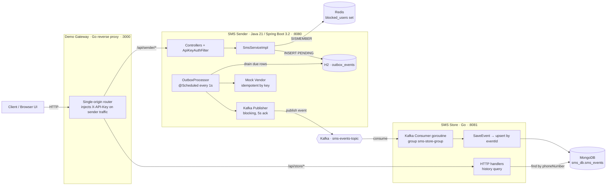
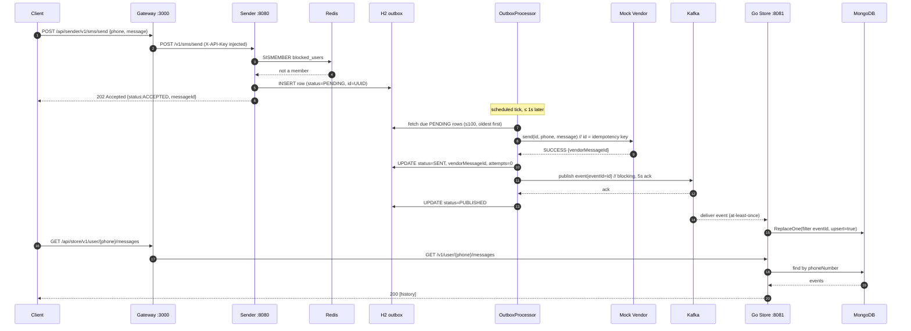
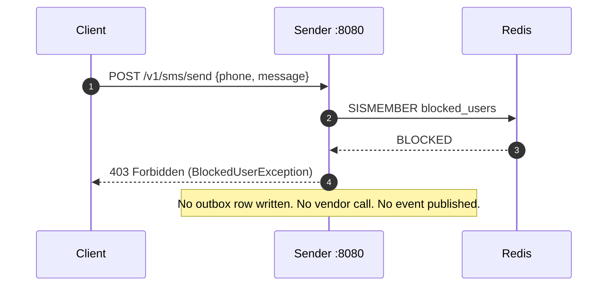
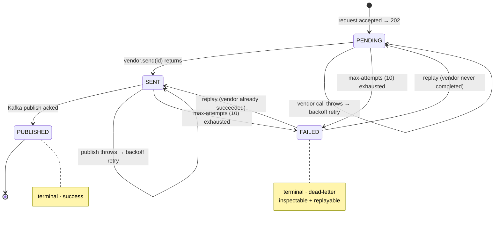
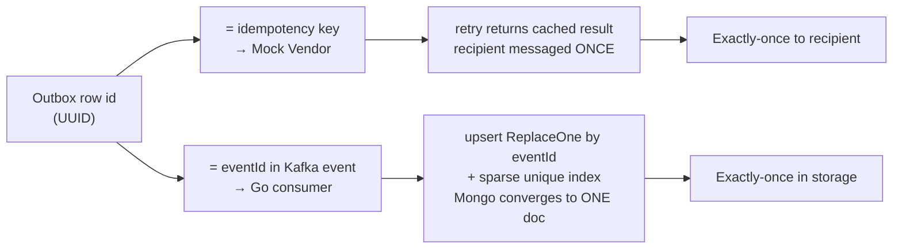
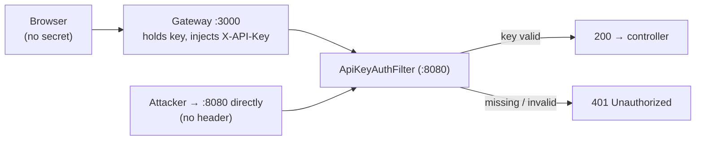
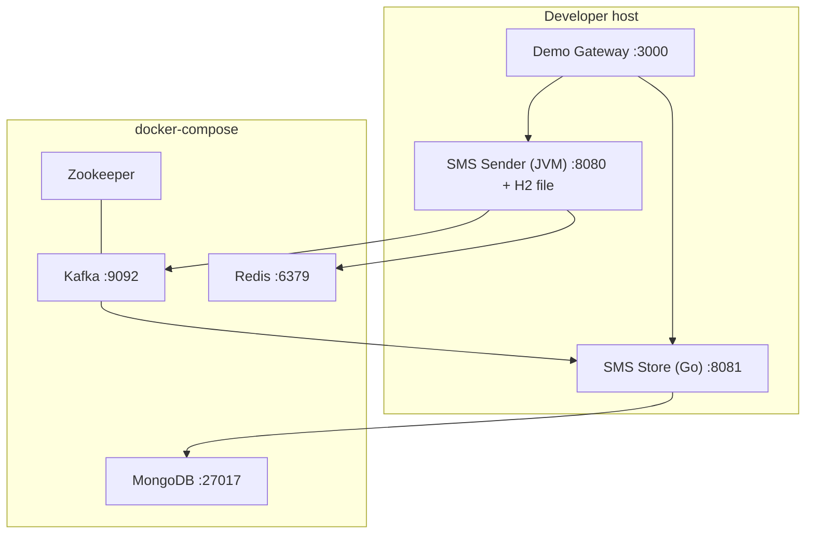

# Distributed SMS Service — Technical Design Report

**HLD + LLD · Design Review**

| | |
|---|---|
| **Author** | Krishna Thakur |
| **Date** | 11 June 2026 |
| **Version** | 1.0 |
| **Status** | Design review — demo implementation complete |
| **Stack** | Java 21 · Spring Boot 3.2.5 · Go 1.23 · Apache Kafka · Redis · MongoDB · H2 · Docker |

---

## 1. Title & Executive Summary

The **Distributed SMS Service** is a polyglot, event-driven platform that accepts SMS-send requests, delivers them to a vendor, and durably records every outcome. Its central design idea is to **decouple acceptance from work**: a request is durably accepted and acknowledged in milliseconds (`HTTP 202`), while the vendor call and event publication happen asynchronously in the background. The system is built from two independently deployable services — a synchronous Java **SMS Sender** and an asynchronous Go **SMS Store** — that never call each other directly; **Kafka is the only link between them**. The cornerstone of the design is a **transactional outbox** with a two-step state machine that, together with an end-to-end idempotency chain, guarantees **exactly-once delivery to both the recipient and the storage layer** even though the message bus in the middle is at-least-once by design. The result is a system that stays responsive under downstream outages, never silently loses an accepted request, never double-sends an SMS, and exposes stuck work as inspectable, replayable dead-letters.

**Three guarantees the design exists to provide:**

| Guarantee | Meaning |
|---|---|
| **Durable acceptance** | Once `202 Accepted` is returned, the request will never be lost. |
| **Exactly-once to recipient** | A retry or crash can never send the same SMS twice. |
| **Exactly-once in storage** | MongoDB holds exactly one record per request, regardless of Kafka redelivery. |

---

## 2. Goals & Non-Goals

### 2.1 Goals

| # | Goal | How it is met |
|---|---|---|
| G1 | **Durable acceptance** — a `202` request is never lost | Outbox row written transactionally before responding |
| G2 | **Exactly-once to the recipient** | Two-step state machine + idempotency key passed to the vendor |
| G3 | **Exactly-once in storage** | Consumer upsert keyed by `eventId` + sparse unique index |
| G4 | **Resilience to downstream outages** | Request path never blocks on Kafka or the vendor; rows queue and drain |
| G5 | **Operability** | Dead-letter (`FAILED`) state with admin list + replay endpoints |
| G6 | **Protected admin surface** | API-key filter on privileged endpoints + trusted-gateway key injection |
| G7 | **Low operational footprint for the demo** | Embedded H2 for the outbox; infra via a single Docker Compose file |

### 2.2 Non-Goals (this iteration)

- **Real vendor integration** — a deterministic in-memory mock stands in for a carrier/aggregator.
- **Multi-tenancy / per-seller isolation** — a single-operator model with one shared admin key.
- **High-availability infrastructure** — single-broker Kafka, single-partition topic, single-node stores.
- **End-user authentication** — only the admin surface is authenticated; `/send` is public.
- **Client-supplied idempotency** — two identical `/send` calls intentionally produce two SMS (see §13).

---

## 3. System Architecture (HLD)

The platform is three processes (two services plus a demo gateway) over four backing stores. The Sender is synchronous and user-facing; the Store is asynchronous and write-heavy. Kafka is the durable buffer between them, so the Sender never blocks on — or fails because of — the Store.



### 3.1 Component table

| Component | Language / Runtime | Port | Role |
|---|---|---|---|
| **SMS Sender** | Java 21, Spring Boot 3.2.5 | 8080 | Synchronous front-facing API; accepts requests, runs the outbox worker, publishes events |
| **SMS Store** | Go 1.23 (`net/http`, `segmentio/kafka-go`) | 8081 | Asynchronous worker; consumes events, persists history, serves history queries |
| **Demo Gateway** | Go stdlib reverse proxy | 3000 | Serves the SPA, routes `/api/sender/*`→8080 and `/api/store/*`→8081 (single origin, no CORS), injects the admin key |
| **Kafka + Zookeeper** | `confluentinc/cp-kafka:7.5.0` | 9092 | Durable, replayable event bus; topic `sms-events-topic`, consumer group `sms-store-group` |
| **Redis** | `redis:7` | 6379 | In-memory `blocked_users` set; O(1) block check on the hot path |
| **MongoDB** | `mongo:6` | 27017 | Document store for SMS event history (`sms_db.sms_events`) |
| **H2** | Embedded in the JVM (not a container) | — | Relational, transactional outbox table; file-backed (`./data/outboxdb`), survives restarts; Postgres-swappable via one datasource line |

### 3.2 Why two services

The Sender is **synchronous and user-facing** — it must respond fast and stay available. The Store is **asynchronous and write-heavy** — it can process at its own pace and can fall behind without affecting acceptance. Splitting them lets each **scale and fail independently**: a Store outage or a Mongo slowdown causes events to buffer in Kafka, but the Sender keeps returning `202` in milliseconds. Kafka is deliberately the *only* coupling — there is no synchronous RPC between the two — which is what makes the failure domains independent and the system replayable (a new consumer can re-read the topic from an offset).

---

## 4. Component Design (LLD)

### 4.1 SMS Sender (Java) — package `com.meesho.sms`

| Class / Component | Layer | Responsibility |
|---|---|---|
| `SmsController` | web | `POST /v1/sms/send`, `GET /v1/sms/health`, `GET/POST/DELETE /v1/sms/block/{phone}` |
| `OutboxController` | web | `GET /v1/sms/outbox` (recent), `GET /v1/sms/outbox/failed`, `POST /v1/sms/outbox/{id}/replay` |
| `ApiKeyAuthFilter` | security | `OncePerRequestFilter` guarding `/v1/sms/block/**` and `/v1/sms/outbox/**` with `X-API-Key` |
| `SmsServiceImpl` | service | Redis block check → write `PENDING` outbox row → return `202` |
| `OutboxProcessor` | worker | `@Scheduled` two-step state machine + exponential backoff + dead-letter |
| `OutboxService` | service | List recent / list failed / replay a dead-lettered row |
| `OutboxRepository` | data | Spring Data JPA; due-row queries bounded to 100 rows, oldest-first |
| `OutboxEvent` | entity | JPA entity mapped to `outbox_events` |
| `MockSmsVendorService` | vendor | Deterministic vendor; idempotent by key via a `ConcurrentHashMap` |
| `KafkaSmsEventPublisher` | event | Serializes `SmsEvent` to JSON, publishes synchronously (worker thread) |
| `GlobalExceptionHandler` | web | Maps `BlockedUserException`→403, validation→400, `NoSuchElement`→404, `IllegalState`→400 |

**Worker mechanics worth noting (from `OutboxProcessor`):**

- One scheduler tick calls `processPending(now)` then `processSent(now)` with a **freshly captured `now` for each step**, so a row promoted `PENDING→SENT` during a tick is **immediately eligible to publish in the same tick** — no extra poll interval is wasted between transitions.
- Each step pulls a **bounded batch of up to 100 due rows** (`findTop100…OrderByCreatedAtAsc`) so a large backlog drains over several cycles instead of blocking one long cycle.
- A transition (`advanceTo`) **resets the retry budget** — `attempts = 0`, `nextAttemptAt = now`, `lastError = null` — so each step gets its own fresh set of attempts.
- The default `@Scheduled` pool is single-threaded, so no two ticks process the same row concurrently.

### 4.2 SMS Store (Go) — module `sms-store-go`

| Package | Responsibility |
|---|---|
| `kafka` | Consumer loop (goroutine): `ReadMessage` → `json.Unmarshal` → hand to service; honors context cancel for graceful stop |
| `services` | `SaveEvent` (Mongo upsert keyed by `eventId`), `GetEventsByUser` (find by `phoneNumber`); `ensureIndexes` builds the sparse unique index |
| `handlers` | HTTP handlers for `GET /health` and `GET /v1/user/{phone}/messages` |
| `models` | Shared `SmsEvent` struct with `json` + `bson` tags |
| `config` | Env-driven configuration with sensible localhost defaults |
| `main` | Wires Mongo client, services, handlers, consumer goroutine, HTTP server, and signal-based graceful shutdown |

The consumer is a single goroutine running `for { ReadMessage … }`; the HTTP server runs in a separate goroutine. On `SIGINT`/`SIGTERM` the consumer context is cancelled and the HTTP server is drained with a 10-second timeout.

### 4.3 Demo Gateway (Go reverse proxy)

A small stdlib `httputil.NewSingleHostReverseProxy` server. It serves `index.html` and routes:

```
/api/sender/*  ->  http://localhost:8080   (+ inject X-API-Key)
/api/store/*   ->  http://localhost:8081
/*             ->  static UI files (:3000)
```

Because the browser only ever talks to **one origin** (`:3000`), CORS disappears with **zero backend changes**. The proxy injects `X-API-Key` only on sender-bound traffic — the trusted-gateway pattern, so the secret never lives in client code. If an upstream is down it returns `502` so the UI can render the service as DOWN.

---

## 5. End-to-End Data Flow

### 5.1 Happy path (send → stored → visible)



### 5.2 Blocked path (rejected before any work)



A blocked number is rejected **synchronously, before any row is queued** — it is the only case where the request path performs a real decision rather than just durably accepting work.

> **Validation note:** an invalid request (blank message, or a phone failing the E.164-style pattern `^\+?[1-9]\d{1,14}$`) is rejected with `400 Bad Request` and a per-field error map, before reaching the Redis check.

---

## 6. The Transactional Outbox (centerpiece)

The request thread does only a **fast local DB write** to `outbox_events`, then returns `202`. A scheduled worker (every 1s) drives each row through a state machine.

### 6.1 State machine



- **`PENDING → SENT`** — call the vendor with idempotency key = the outbox row `id`, record the vendor outcome (`vendorStatus`, `vendorMessageId`, `errorReason`).
- **`SENT → PUBLISHED`** — publish the recorded event to Kafka (blocking, 5s ack), then mark terminal.

> **Business failure vs. infrastructure failure:** a *carrier rejection* (the mock's deterministic `9999999999` case) is a **business outcome** — the row still advances to `SENT` with `vendorStatus=FAILED` and the event is published with `status=FAILED`. Only a **thrown exception** (an infrastructure failure on the vendor call or the Kafka publish) triggers a backoff retry. This keeps "the carrier said no" out of the retry/dead-letter machinery, which is reserved for transient infra problems.

### 6.2 Why two steps (the no-duplicate-SMS guarantee)

Splitting "call the vendor" (`PENDING→SENT`) from "publish the event" (`SENT→PUBLISHED`) is the heart of the **no-duplicate-SMS** guarantee. **Once a row is `SENT`, a Kafka failure only retries the publish step — the vendor is never called again.** If the two were a single step, every publish retry would risk re-sending the SMS. The separation confines vendor contact to exactly one state transition.

### 6.3 Backoff & dead-letter

On repeated failure at the current step, the worker schedules an exponential-backoff retry by stamping a future `nextAttemptAt`; only rows whose backoff has elapsed are picked up.

```
delay = backoff-base-ms × 2^(attempts-1), capped at backoff-max-ms
      = 2s → 4s → 8s → 16s → 32s → 64s → 128s → 256s → 300s (capped)
```

With `max-attempts = 10`, a row only dead-letters after a backoff window spanning **~13 minutes of continuous failure** — long enough to **ride out a transient Kafka outage instead of quarantining good messages**. After the cap, the row becomes `FAILED` (dead-letter) and the worker stops touching it.

`FAILED` rows are inspectable (`GET /v1/sms/outbox/failed`) and replayable (`POST /v1/sms/outbox/{id}/replay`). **Replay resumes from the correct step** so the no-double-send guarantee survives a replay too: if the vendor already succeeded (`vendorStatus` is set) it resumes at `SENT` (publish only); otherwise it restarts at `PENDING`.

---

## 7. Reliability & Idempotency

Each failure mode below was found by **stress-testing the pipeline** (kill Kafka, crash mid-step, redeliver) and closed with a concrete change.

| # | Failure mode | Resolution | Status |
|---|---|---|---|
| 1 | **Event lost when Kafka is down** (originally fire-and-forget on the request thread) | Outbox pattern — durable H2 queue + async worker; request path never blocks on Kafka | **FIXED** |
| 2 | **Duplicate SMS on retry / worker crash** | Two-step state machine + idempotency key passed to the vendor | **FIXED** |
| 3 | **Duplicate events in MongoDB** (Kafka at-least-once) | Consumer upsert keyed by `eventId` + sparse unique index | **FIXED** |
| 4 | **Poison messages retrying forever** | Exponential backoff + dead-letter (`FAILED`) + admin replay | **FIXED** |
| 5 | **Open admin endpoints** (anyone could block / replay) | `X-API-Key` filter on the admin surface + gateway key injection | **FIXED** |

> **Live-validated:** during testing, a Kafka restart produced **3 duplicate Mongo rows** — exactly the predicted at-least-once behaviour — which the `eventId` upsert then collapsed back to **one**. The diagnosis and the fix matched.

### 7.1 The idempotency chain (exactly-once end to end)



- **Vendor side:** idempotency key = outbox row `id` → a retry returns the cached result without re-contacting the carrier → the recipient is messaged **exactly once**. *(A real vendor enforces this server-side — e.g. Stripe-style idempotency keys; the demo mock simulates it in an in-memory `ConcurrentHashMap`.)*
- **Storage side:** `eventId` (= outbox row `id`) is carried in the Kafka event; the Go consumer **upserts (`ReplaceOne`) keyed by `eventId`**, backed by a **sparse unique index** → MongoDB converges to exactly one document even though Kafka delivery is at-least-once.
- **Net guarantee:** exactly-once to the recipient **and** exactly-once in storage; duplicates in the Kafka stream are harmless.

### 7.2 The crash window — why the idempotency key still matters

The vendor call and the `SENT` status write are **not atomic**. If the worker crashes *between* them, the row is still `PENDING` and the vendor would be called again on restart. This is precisely why the idempotency key exists: the vendor dedups on the row `id`, so even that window cannot double-send. The two-step machine handles the *normal* path; the idempotency key is the **backstop** for the crash path.

### 7.3 Consumer-side delivery semantics (precise note)

The Go consumer uses `kafka-go`'s `ReadMessage` with a `GroupID`, which **auto-commits offsets**. The dangerous duplicate case (redelivery) is fully handled by the `eventId` upsert. The remaining edge to be aware of is a *persistent* Mongo write failure: the error is logged and the loop continues, so a row that can never be written would not be retried indefinitely by the consumer. In practice the Sender is the durable system of record (the outbox row remains `PUBLISHED`), and hardening the consumer to commit only after a successful write is a small, additive change. This does not affect the duplicate-suppression guarantee, which is the property the design set out to deliver.

---

## 8. Data Model

### 8.1 Outbox row — H2 table `outbox_events`

| Column | Type | Purpose |
|---|---|---|
| `id` | `VARCHAR` (PK) | UUID; **also the idempotency key and the eventId** |
| `phoneNumber` | `VARCHAR` | Recipient |
| `message` | `VARCHAR(1000)` | Body |
| `status` | `ENUM` (string) | `PENDING` / `SENT` / `PUBLISHED` / `FAILED` |
| `vendorStatus` | `VARCHAR` | `SUCCESS` / `FAILED` (set at `SENT`) |
| `vendorMessageId` | `VARCHAR` | Vendor receipt id |
| `errorReason` | `VARCHAR` | Vendor business error (e.g. "Carrier rejected message") |
| `attempts` | `INT` | Failures at the **current** step (reset to 0 on each transition) |
| `nextAttemptAt` | `TIMESTAMP` | Backoff gate — earliest eligible processing time |
| `lastError` | `VARCHAR(500)` | Last infrastructure failure, for dead-letter inspection |
| `createdAt` / `updatedAt` | `TIMESTAMP` | Lifecycle timestamps |

JPA is configured with `ddl-auto: update`; H2 runs file-backed (`jdbc:h2:file:./data/outboxdb;AUTO_SERVER=TRUE`) so the queue survives restarts, with the H2 console exposed at `/h2-console` for the demo.

### 8.2 Event on the wire / MongoDB document — `sms_db.sms_events`

```json
{
  "eventId": "c42490c2-ecd1-4bb6-ada2-2b9bfd378fe8",
  "phoneNumber": "8888888888",
  "message": "Hello there",
  "status": "SUCCESS",
  "vendorMessageId": "VND-7f3a...",
  "errorReason": null,
  "timestamp": "2026-06-11T14:22:37+05:30"
}
```

- `eventId` is the dedup key and carries the outbox row `id` unchanged across republishes.
- `status` here is the **vendor outcome** (`SUCCESS`/`FAILED`), not the outbox lifecycle status.
- A **unique sparse index** (`uniq_eventId`) on `eventId` enforces one document per request and is created on startup by `ensureIndexes`.
- The Kafka message **key** is the `phoneNumber` (so a recipient's events land on the same partition and preserve order); the **value** is the JSON above.

### 8.3 Redis

A single Set, `blocked_users`, holding blocked phone numbers, checked with `SISMEMBER` (O(1)) on **every** send.

---

## 9. Security

Admin endpoints (`/v1/sms/block/**` and `/v1/sms/outbox/**`) require an `X-API-Key` header validated by a Spring `OncePerRequestFilter` (`ApiKeyAuthFilter`). Missing or invalid → **`401 Unauthorized`** (JSON error body). The public endpoints `/v1/sms/send` and `/v1/sms/health` are open.



The reverse-proxy gateway injects the key for browser traffic, so the **secret never lives in client code** (the *trusted-gateway* pattern); direct access to the service without the key is rejected. The default key is `demo-secret-key-change-me`, overridable via the `ADMIN_API_KEY` environment variable (the gateway reads the same variable so the two stay in sync). This is correct for an internal single-operator deployment; the production path is per-seller keys or JWT/OAuth2 with roles (see §13).

---

## 10. Technology Choices & Rationale

| Technology | Used for | Why this tool |
|---|---|---|
| **Redis** | Blocklist (hot path) | In-memory, sub-millisecond; the native Set type fits "is this number blocked?" with an O(1) `SISMEMBER` |
| **Kafka** | Async event bus | Durable, replayable, decouples the two services; consumer groups give horizontal consumer scaling and offset tracking |
| **MongoDB** | Event history | Flexible JSON documents for a write-heavy append/lookup workload; schema can evolve without migrations |
| **H2 (embedded)** | Outbox table | Relational + **transactional** state machine with zero extra infrastructure; file-backed for durability; one-line swap to Postgres |
| **Spring Boot (Java 21)** | Sender | First-class Kafka/Redis/validation/JPA support; `@Scheduled` for the worker; LTS runtime |
| **Go** | Store | Lightweight goroutine concurrency — one goroutine for the consumer loop, one for the HTTP server; small, fast binary |
| **Zookeeper** | Kafka coordination | Required by this Kafka version; not used directly by application code |
| **Docker Compose** | Local infra | One file brings up Kafka, Zookeeper, Mongo, and Redis for the demo |

The throughline: **each store is chosen for its data shape and access pattern** — fast set lookups in Redis, a transactional state machine in a relational DB, a durable replayable bus in Kafka, and a flexible append-log in MongoDB.

---

## 11. API Reference

### 11.1 Java SMS Sender (`:8080`)

| Method | Path | Auth | Description | Response |
|---|---|---|---|---|
| `POST` | `/v1/sms/send` | public | Accept an SMS request | `202` `{status:"ACCEPTED", messageId, message}` |
| `GET` | `/v1/sms/health` | public | Liveness | `200` `{status:"UP"}` |
| `GET` | `/v1/sms/block/{phone}` | key | Check if a number is blocked | `200` `{phoneNumber, blocked, message}` |
| `POST` | `/v1/sms/block/{phone}` | key | Block a number | `200` `{phoneNumber, blocked:true, …}` |
| `DELETE` | `/v1/sms/block/{phone}` | key | Unblock a number | `200` `{phoneNumber, blocked:false, …}` |
| `GET` | `/v1/sms/outbox` | key | List up to 100 recent outbox rows (monitor) | `200` `[OutboxEvent]` |
| `GET` | `/v1/sms/outbox/failed` | key | List dead-lettered rows | `200` `[OutboxEvent]` |
| `POST` | `/v1/sms/outbox/{id}/replay` | key | Requeue a `FAILED` row | `200` `OutboxEvent` |

**Request body for `/send`:**

```json
{ "phoneNumber": "+919876543210", "message": "Hello there" }
```

**Error responses:** `400` (validation), `403` (blocked recipient), `401` (missing/invalid API key on admin paths), `404` (replay of unknown id), `400` (replay of a non-`FAILED` row).

### 11.2 Go SMS Store (`:8081`)

| Method | Path | Description | Response |
|---|---|---|---|
| `GET` | `/health` | Liveness | `200` |
| `GET` | `/v1/user/{phone}/messages` | All stored events for a number | `200` `[SmsEvent]` (empty array if none) |

---

## 12. Configuration Reference

### 12.1 Java Sender (`application.yml`)

| Setting | Default | Meaning |
|---|---|---|
| `server.port` | `8080` | HTTP port |
| `outbox.poll-interval-ms` | `1000` | Worker scan cadence (`@Scheduled` fixed delay) |
| `outbox.max-attempts` | `10` | Failures at one step before dead-letter (`FAILED`) |
| `outbox.backoff-base-ms` | `2000` | First retry delay; doubles each attempt |
| `outbox.backoff-max-ms` | `300000` | Retry-delay cap (5 min) |
| `admin.api-key` | env `ADMIN_API_KEY` ⇒ `demo-secret-key-change-me` | Shared admin secret |
| `spring.kafka.producer.retries` | `3` | Producer auto-retry on transient failure |
| `spring.kafka.producer.properties.retry.backoff.ms` | `1000` | Delay between producer retries |
| `spring.kafka.producer.properties.max.block.ms` | `3000` | Max time `send()` blocks when the buffer is full |
| `spring.datasource.url` | `jdbc:h2:file:./data/outboxdb;AUTO_SERVER=TRUE` | File-backed outbox DB |
| `spring.data.redis.host/port` | `localhost:6379` | Redis connection |

### 12.2 Go Store (environment)

| Variable | Default | Meaning |
|---|---|---|
| `SERVER_PORT` | `8081` | HTTP port |
| `MONGO_URI` | `mongodb://localhost:27017` | Mongo connection |
| `MONGO_DB_NAME` | `sms_db` | Database name |
| `KAFKA_BROKERS` | `localhost:9092` | Comma-separated broker list |
| `KAFKA_TOPIC` | `sms-events-topic` | Topic name (shared with the Sender) |
| Consumer `GroupID` | `sms-store-group` | Consumer group for offset tracking |

---

## 13. Deployment

### 13.1 Demo topology

Infrastructure (Kafka, Zookeeper, MongoDB, Redis) runs via `docker-compose`. The two services and the proxy run **directly on the host** so logs and restarts are visible during the demo. All dependencies are reached over `localhost`. H2 is embedded in the JVM — no container.



### 13.2 Production topology

- **All components containerized** via multi-stage Dockerfiles; each service ships its own runtime.
- Dependencies addressed by **container/DNS name, not `localhost`**.
- Orchestrated by **Kubernetes** for auto-restart, horizontal scaling, and zero-downtime rolling deploys.
- **Kafka:** 3 brokers, replication factor 3, multiple partitions, `acks=all` + idempotent producer, `min.insync.replicas=2`.
- **H2 → managed Postgres** (one datasource line).
- **Secrets** via a secret manager, not config files.

---

## 14. Known Limitations & Roadmap

All open items are **configuration or additive changes — none require re-architecting the core.**

| Limitation | Impact | Planned resolution |
|---|---|---|
| Mock idempotency map is in-memory | Dedup state lost on JVM restart | Real vendor enforces idempotency server-side |
| No client-level idempotency | Two identical `/send` calls = two SMS | Client-supplied idempotency key on the request |
| Single Kafka partition & replica | No consumer scaling; a broker crash can lose data | 3 replicas, N partitions, `min.insync.replicas=2` |
| No producer idempotence / `acks=all` | A lost ack can duplicate at the source | `enable.idempotence=true` + `acks=all` |
| Unbounded history query | Large result sets load fully into memory | Pagination (`page`/`limit`) + index on `phoneNumber` |
| Shared admin key | No per-user identity; can't scale to many sellers | Per-seller API keys + tenant isolation (Twilio/Stripe model) |
| No outbox retention | `PUBLISHED` rows accumulate forever | Scheduled archival/cleanup job |
| Consumer auto-commits before write confirm | A persistent Mongo failure could drop an event | Commit offset only after a successful upsert |

**The working method.** Start simple, then systematically stress-test: *what if Kafka dies? what if the worker crashes mid-step? what if a message is redelivered?* Each question exposed a real failure mode and led to a concrete fix. **Where it stands:** the outbox foundation, the end-to-end idempotency chain, and the public/admin split are production-shaped. The remaining work is **scaling and multi-tenancy — the next layer, not dead-ends.**

---

## 15. Glossary

| Term | Definition |
|---|---|
| **Transactional outbox** | Persist intent to a local (transactional) table first, then process asynchronously, so acceptance is decoupled from work and nothing accepted is ever lost. |
| **Idempotency key** | A stable per-request identifier ensuring a repeated operation has the same effect as performing it once. Here it is the outbox row `id`, reused as both the vendor key and the `eventId`. |
| **At-least-once delivery** | Kafka's guarantee that a message is delivered one or more times — so consumers must be idempotent. |
| **Dead-letter queue** | A terminal `FAILED` state for messages that exhaust their retries, set aside for inspection and manual replay rather than discarded or retried forever. |
| **Consumer group** | A named set of consumers that share a topic's partitions and jointly track processed offsets; the basis for horizontal consumer scaling. |
| **Exponential backoff** | Increasing the delay between successive retries (here doubling: 2s → 4s → 8s …) to ride out transient outages without hammering a struggling dependency. |

---

*Distributed SMS Service · Technical Design Review · v1.0 · Krishna Thakur · 11 June 2026*